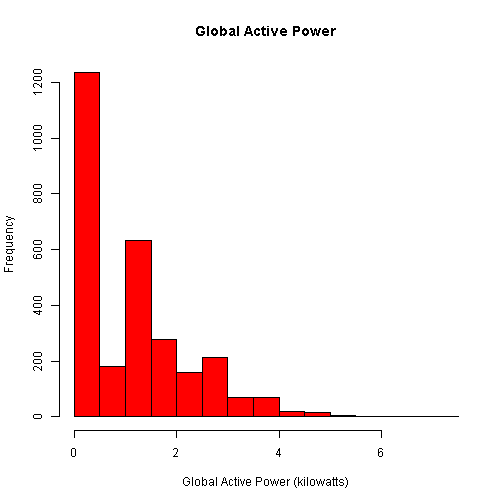

Introduction

This assignment uses data from the UC Irvine Machine Learning Repository, a popular repository for machine learning datasets. In particular, we will be using the “Individual household electric power consumption Data Set” which I have made available on the course web site:

Dataset: Electric power consumption [20Mb]

Description: Measurements of electric power consumption in one household with a one-minute sampling rate over a period of almost 4 years. Different electrical quantities and some sub-metering values are available.

The following descriptions of the 9 variables in the dataset are taken from the UCI web site:

Date: Date in format dd/mm/yyyy
Time: time in format hh:mm:ss
Global_active_power: household global minute-averaged active power (in kilowatt)
Global_reactive_power: household global minute-averaged reactive power (in kilowatt)
Voltage: minute-averaged voltage (in volt)
Global_intensity: household global minute-averaged current intensity (in ampere)
Sub_metering_1: energy sub-metering No. 1 (in watt-hour of active energy). It corresponds to the kitchen, containing mainly a dishwasher, an oven and a microwave (hot plates are not electric but gas powered).
Sub_metering_2: energy sub-metering No. 2 (in watt-hour of active energy). It corresponds to the laundry room, containing a washing-machine, a tumble-drier, a refrigerator and a light.
Sub_metering_3: energy sub-metering No. 3 (in watt-hour of active energy). It corresponds to an electric water-heater and an air-conditioner.


download file and unzip as household_power_consumption

```r
download.file("https://d396qusza40orc.cloudfront.net/exdata%2Fdata%2Fhousehold_power_consumption.zip", "household_power_consumption.zip")
unzip("household_power_consumption.zip", overwrite=TRUE)
```


read in as CSV with proper formating 

```r
power_data<-read.csv("household_power_consumption.txt", header=TRUE, sep=';', na.strings="?", nrows=2075259, check.names=FALSE, stringsAsFactors=FALSE, comment.char="", quote='\"')
```


Read date using as.Date


```r
class(power_data$Date)
```

```
## [1] "character"
```

```r
power_data$Date <- as.Date(power_data$Date, format="%d/%m/%Y")
class(power_data$Date)
```

```
## [1] "Date"
```

Subset the required dates of interest

```r
power_con<- subset(power_data, subset=(Date >= "2007-02-01" & Date <= "2007-02-02"))
```


converting date and time


```r
date.time<- paste(as.Date(power_con$Date), power_con$Time)
power_con$DateTime<- as.POSIXct(date.time)
head(power_con$DateTime)
```

```
## [1] "2007-02-01 00:00:00 CST" "2007-02-01 00:01:00 CST"
## [3] "2007-02-01 00:02:00 CST" "2007-02-01 00:03:00 CST"
## [5] "2007-02-01 00:04:00 CST" "2007-02-01 00:05:00 CST"
```

make Plot 1

```r
hist(power_con$Global_active_power, main="Global Active Power", xlab="Global Active Power (kilowatts)", ylab="Frequency" , col="Red")
```

 

create png file

```r
dev.copy (png, file="plot1.png")
```

```
## png 
##   5
```

```r
dev.off()
```

```
## RStudioGD 
##         2
```
